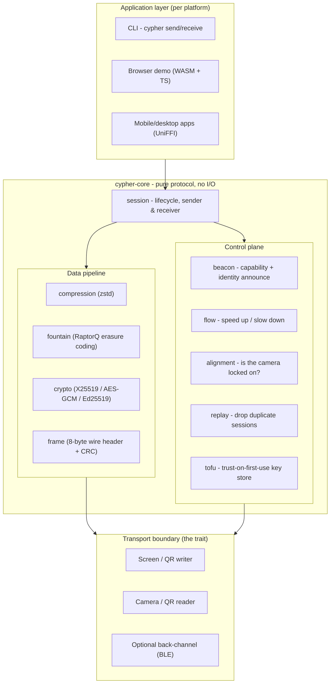
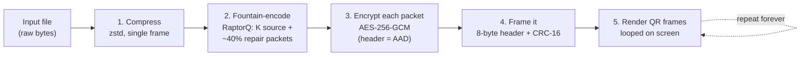
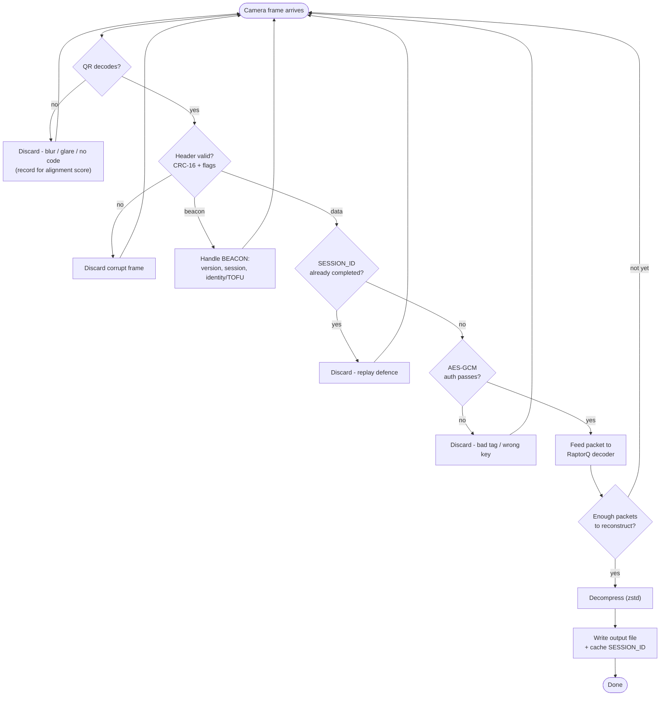
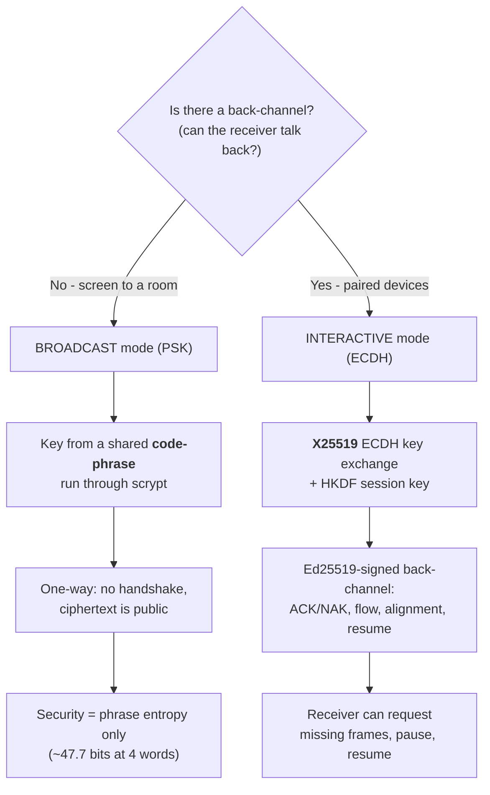
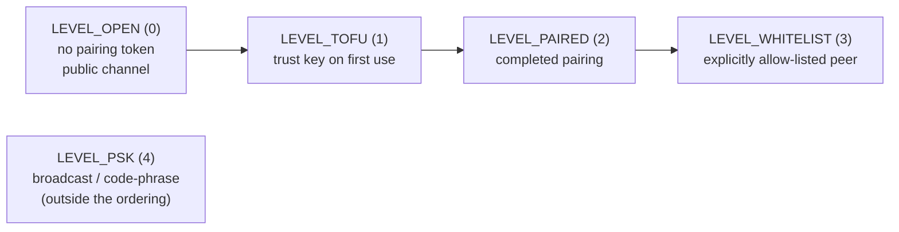
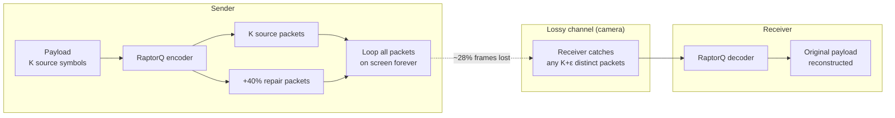

# Cypher

**Cypher is an optical data-transmission protocol.** It moves files from one device to another using nothing but a screen and a camera - the sender renders your data as a looping sequence of QR codes, and the receiver points a camera (or reads a recorded video) to reconstruct the original file. No network, no Bluetooth, no pairing cable. The only channel is light.

That constraint makes Cypher useful in exactly the places a network isn't available or isn't trusted: moving data across an air gap, out of a locked-down environment, or between two people who share a screen but nothing else. Because the "wire" is a camera looking at a screen, the protocol is built from the ground up around the two things that channel does badly - it's **lossy** (frames get dropped, blurred, glared out) and **one-way** (a broadcast screen has no idea who's watching). Everything below is a consequence of taking those two facts seriously.

---

## Table of contents

- [What you can do with it](#what-you-can-do-with-it)
- [The big picture](#the-big-picture)
- [How a transfer works](#how-a-transfer-works)
  - [Sending](#sending-the-encode-pipeline)
  - [Receiving](#receiving-the-decode-pipeline)
- [The two session modes](#the-two-session-modes)
- [Trust levels](#trust-levels)
- [The wire format](#the-wire-format)
- [Reliability: fountain coding](#reliability-fountain-coding)
- [Security model](#security-model)
- [Repository layout](#repository-layout)
- [Building and running](#building-and-running)
- [The browser demo](#the-browser-demo)
- [Language bindings](#language-bindings)
- [Glossary](#glossary)

---

## What you can do with it

- **Send a file as a video.** `cypher send secret.pdf` turns a file into an MP4 of scrolling QR frames (or shows the loop live in a window). Play it on any screen.
- **Receive from a camera or a file.** `cypher receive` watches your webcam; point it at the playing screen and the file rebuilds itself. Or feed it a recorded `.mp4` to decode offline.
- **Broadcast to a room.** One screen, many cameras. Everyone who knows the code-phrase decrypts the same file; nobody needs to be individually paired.
- **Run it anywhere.** The protocol core compiles to native (CLI), to WebAssembly (the in-browser demo), and to mobile/desktop languages through UniFFI (Swift, Kotlin, Python, C#).

---

## The big picture

Cypher is deliberately layered. The **protocol core** knows nothing about screens or cameras - it only ever sees byte frames. Anything physical (a display, a webcam, a Bluetooth back-channel) lives behind a single `Transport` trait. This is what lets the exact same protocol logic run in a terminal, a browser tab, and an iOS app without change.



The rule that keeps the design honest: **the core never imports a display or camera API.** Tests drive it through an in-memory `LoopbackTransport`, and real hardware is just another implementation of the same trait.

---

## How a transfer works

### Sending: the encode pipeline

Your file goes through five stages before it ever hits the screen. Order matters - in particular, **compression happens before encryption** (encrypted bytes are random and don't compress), and **each fountain packet is encrypted individually** so the receiver can decrypt whatever subset of packets it manages to catch.



Stage by stage:

1. **Compress** - one zstd frame. A `COMPRESSED` flag in the header records whether this ran (tiny or already-compressed payloads may skip it).
2. **Fountain-encode** - the payload is split into `K` source symbols, and RaptorQ generates `K` plus roughly 40% *repair* symbols. The sender then loops this packet list on screen indefinitely. This is the trick that makes a lossy one-way channel work (see [Reliability](#reliability-fountain-coding)).
3. **Encrypt** - each packet is sealed with AES-256-GCM under the session key. The frame's 6-byte header prefix is fed in as **Associated Data (AAD)**, so tampering with the header is detected.
4. **Frame** - prepend the compact 8-byte wire header and a CRC-16 trailer (details in [the wire format](#the-wire-format)).
5. **Render** - each frame becomes a QR code. Frames loop; a receiver joining halfway through still finishes, because it just needs *enough distinct packets*, not a specific start point.

Interleaved with the data frames, the sender periodically emits a **BEACON** - a small unencrypted frame announcing the protocol version, session ID, its display capabilities, and (in secured modes) a signed identity. That's how a receiver discovers a transfer it wasn't already synced to.

### Receiving: the decode pipeline

The receiver runs the same steps in reverse, but it's fundamentally a *collector*: it keeps ingesting frames until the fountain decoder says "I have enough."



Two supporting systems run alongside this loop:

- **Alignment** watches how well the camera is actually seeing the screen (marker count, sharpness, recent decode rate) and produces an `ALIGNED` / `DEGRADED` / `LOST` / `RECOVERING` state. In interactive mode it can signal the sender.
- **Flow control** tracks the decode success rate over a sliding window and asks the sender to speed up or slow down its frame rate - but at most one signal per 30 frames, so the sender's rate doesn't oscillate.

---

## The two session modes

Cypher has one protocol with two personalities, chosen by whether a **back-channel** exists.



- **Broadcast (PSK).** One-way. There is no handshake and anyone can capture the video, so the *only* thing protecting the payload is the entropy of the shared code-phrase. Cypher runs the phrase through the deliberately-slow **scrypt** KDF and defaults to a **4-word** phrase (~47.7 bits over its 3,859-word list); add words to add ~11.9 bits each. This is the "play it on a projector, everyone in the room with the phrase gets the file" mode.
- **Interactive (ECDH).** Two paired devices with a real back-channel (e.g. Bluetooth LE). They do an **X25519** key exchange, derive a session key via HKDF, and gain a signed control channel: the receiver can `NAK` specific missing frame numbers, drive flow control precisely, and pause/resume a stuck transfer. Identities are **Ed25519**-signed and verified.

---

## Trust levels

Every session advertises a trust level in its BEACON. Higher is stricter.



**TOFU (Trust On First Use)** works like SSH host keys: the first time you see a peer's identity key, you record it; if it ever presents a *different* key later, the store hard-fails with a "key has changed" error and demands explicit re-approval. The key store is a simple file-backed `{peer → key}` map, with the actual secure storage (keychain / secure enclave) left as a deployment concern.

---

## The wire format

Every frame - data, beacon, or control - begins with the same compact **8-byte header**, followed by the payload, and is validated by a trailing **CRC-16** (`CRC_16_IBM_3740`, chosen to match Python's `binascii.crc_hqx`).

```
 byte:  0        1        2        3        4        5        6        7
      ┌────────┬────────┬────────┬────────┬────────┬────────┬────────┬────────┐
      │  TAG(0x5) + FRAME_NUMBER   │ FLAGS  │   PAYLOAD_LENGTH│      CRC-16     │
      │      (4 bits + 20 bits)    │ (8b)   │      (u16 BE)   │     (u16 BE)    │
      └────────┴────────┴────────┴────────┴────────┴────────┴────────┴────────┘
      └──────────── 6-byte prefix = AES-GCM AAD ─────────────┘
```

- **TAG** - a constant `0x5` in the top 4 bits, a cheap sanity check.
- **FRAME_NUMBER** - 20 bits, so up to `1,048,575` frames per session.
- **FLAGS** - one byte of bit flags: `ENCRYPTED`, `COMPRESSED`, `KEYFRAME`, `LAST_FRAME`, `PRIORITY`, `BEACON`, `RECEIVER_BEACON` (bit 7 reserved).
- **PAYLOAD_LENGTH** - `u16`, up to 65,535 bytes.
- **CRC-16** - covers the header; it is deliberately **not** part of the AAD, because it depends on ciphertext that isn't known when the AAD is fixed.

The whole frame is capped at `MAX_WIRE = 1000` bytes so it comfortably fits one QR code. A BEACON is just a frame with `FRAME_NUMBER = 0` and the `BEACON` flag set; its body carries the protocol `VERSION` (the only place the version byte rides the wire), the `SESSION_ID`, capability fields, and an identity signature.

---

## Reliability: fountain coding

This is the heart of why Cypher works over a channel it can't control. A camera pointed at a looping screen will randomly miss frames - a hand passes by, the autofocus hunts, a frame is mid-transition. A naive "frame 1, frame 2, frame 3…" scheme would stall forever waiting for the one frame that keeps getting dropped.

**RaptorQ fountain coding** (RFC 6330) sidesteps this entirely. Think of the payload as needing `K` "buckets" of information. The encoder can generate a *practically unlimited* stream of packets, and the receiver reconstructs the original from **any `K + ε`** of them - it does not matter *which* ones.



The default **40% repair overhead** is tuned so a receiver typically finishes within about one loop of the video even at up to ~28% frame loss. Lose more? The receiver just watches another loop and picks up the packets it missed. There is never a "please resend frame 37" round-trip in broadcast mode - that request can't exist on a one-way channel, and fountain coding means it doesn't need to.

---

## Security model

What Cypher does and does not protect, stated plainly:

- **Confidentiality** - payloads are AES-256-GCM encrypted. In broadcast mode the key comes from a scrypt-stretched code-phrase; in interactive mode from an X25519/HKDF session key. The video itself is public bytes, so in broadcast mode **your phrase is the whole of your security** - pick enough words.
- **Integrity / tamper detection** - AES-GCM's authentication tag plus the header-as-AAD binding means a modified frame fails to decrypt rather than silently corrupting output.
- **Authenticity** - identities are Ed25519 keys, verified and pinned via TOFU. A changed key is a hard failure.
- **Replay resistance** - each completed `SESSION_ID` is cached (with a TTL and LRU eviction); a frame from an already-finished session is dropped silently.
- **Key hygiene** - key material is zeroized on drop (the dalek types and the derived `SessionKey` both wipe themselves).
- **Path-traversal safety** - a received filename is sanitized so a malicious sender can't write to `../../../evil_place/`.

Provisional / not-yet-frozen: some back-channel message type IDs and the HANDSHAKE_ACK/NAK encodings are marked PROVISIONAL in the source and may change.

---

## Repository layout

```
semaphore/
├── rust/
│   ├── src/                    # the `cypher` CLI + app-side modules
│   │   ├── main.rs             #   send / receive subcommands
│   │   ├── qr.rs               #   QR write/read (zxing-cpp)
│   │   ├── video.rs            #   MP4 encode/decode (ffmpeg)
│   │   └── camsim.rs           #   camera simulation for tests
│   ├── core/                   # cypher-core: the pure protocol (no I/O)
│   │   └── src/
│   │       ├── frame.rs        #   8-byte wire header + CRC
│   │       ├── compression.rs  #   zstd stage
│   │       ├── fountain.rs     #   RaptorQ erasure coding
│   │       ├── crypto.rs       #   X25519 / AES-GCM / Ed25519 / scrypt
│   │       ├── session.rs      #   sender & receiver lifecycle
│   │       ├── transport.rs    #   the Transport trait + loopback
│   │       ├── beacon.rs       #   capability + identity announce
│   │       ├── phrase.rs       #   code-phrase word picking
│   │       ├── tofu.rs         #   trust-on-first-use key store
│   │       ├── replay.rs       #   duplicate-session cache
│   │       ├── flow.rs         #   speed-up / slow-down control
│   │       ├── alignment.rs    #   camera-lock state machine
│   │       ├── messages.rs     #   back-channel message codec
│   │       └── wordlist.txt    #   3,859-word phrase list (pinned)
│   ├── bindings/
│   │   ├── wasm/               #   wasm-pack build → @konsept/cypher
│   │   └── uniffi/             #   Swift / Kotlin / Python / C# bindings
│   └── tests/                  # conformance vectors + property tests
└── demo/                       # browser demo (Vite + TypeScript)
    └── src/
        ├── main_code.ts        #   demo app
        └── qr_stuff.ts         #   in-browser QR read/write
```

---

## Building and running

### The Rust CLI

```bash
cd rust
cargo build --release
```

**Send a file** (writes an MP4 of QR frames):

```bash
cypher send secret.pdf --out secret.mp4
# or show the loop live in a window instead of writing a file:
cypher send secret.pdf --live
# no-password broadcast anyone can decrypt:
cypher send public.txt --open
```

**Receive a file** (webcam by default, or decode an existing video):

```bash
cypher receive --out ./downloads          # watch the webcam
cypher receive --file secret.mp4 --out .   # decode offline from a video
cypher receive --open                      # listen to a public broadcast
```

Useful `send` flags: `--fps` (frame rate), `--grid` (tile N×N QR codes per frame for higher throughput), `--loss` (raise the fountain repair overhead for a worse channel), `--target phone|laptop|monitor` (size frames to the receiver's screen). If you don't supply a password, one is generated and printed for you.

### Running the tests

```bash
cd rust
cargo test --workspace
```

The suite includes **conformance vectors** (JSON fixtures in `tests/vectors/` that pin the exact wire bytes, so any accidental format change is caught) and **property tests** via `proptest`. The bundled zxing-cpp C++ is force-built optimized even in test profiles - this compiles out an upstream debug-only bounds assertion that could otherwise abort the process on rare, heavily-distorted adversarial QR images.

### Feature flags

`cypher-core` has two features, both on by default:

- `compression` - gates the **C zstd encoder**. It won't build to wasm, so the wasm target turns it off. Decompression is *always* available (via the pure-Rust `ruzstd` decoder when the feature is off).
- `fs` - gates the file-backed TOFU store's `std::fs` I/O. Off for wasm; the in-memory trust store still works there.

The wasm build uses `--no-default-features` to drop both, keeping only the paths that run in a bare browser VM.

---

## The browser demo

A zero-install version runs entirely in the browser: the protocol core is compiled to WebAssembly (`@konsept/cypher`, built with wasm-pack) and driven by TypeScript, with QR read/write via `jsqr` and `nayuki-qr-code-generator`.

```bash
cd demo
npm install
npm run dev        # start the Vite dev server
npm run test       # vitest
npm run typecheck  # tsc --noEmit
```

Because the wasm build has no C zstd encoder and no filesystem, it exercises the same in-memory, decode-capable, broadcast-PSK paths the protocol guarantees are wasm-safe.

---

## Language bindings

Beyond native and wasm, `cypher-core` is exported through **UniFFI**, with generated bindings and small proof-of-life programs checked in for:

| Language | Generated binding | Proof program |
|----------|-------------------|---------------|
| Swift    | `generated/swift/` | `swift_proof/main.swift` |
| Kotlin   | `generated/kotlin/` | `kotlin_proof/Main.kt` |
| Python   | `generated/python/` | `python_proof/proof.py` |
| C#       | `generated/csharp/` | `csharp_proof/Program.cs` |

The UniFFI binding is built on its own (`cargo build -p cypher-ffi`) and kept out of the main workspace so `cargo test --workspace` stays fast and unaffected.

---

## Glossary

- **Fountain / rateless code** - an erasure code that emits unlimited packets; the receiver rebuilds the whole from any sufficiently-large subset. Cypher uses RaptorQ (RFC 6330).
- **BEACON** - a small unencrypted frame the sender emits periodically to announce version, session, capabilities, and identity, so receivers can discover and join a transfer.
- **TOFU** - Trust On First Use. Pin a peer's key the first time you see it; reject any later change. The SSH host-key model.
- **PSK** - Pre-Shared Key. Broadcast mode's key, derived from a human code-phrase via scrypt.
- **ECDH** - Elliptic-Curve Diffie-Hellman (X25519 here). Interactive mode's key exchange.
- **AAD** - Associated Data. Bytes authenticated but not encrypted by AES-GCM; Cypher binds the frame header this way.
- **Back-channel** - any return path from receiver to sender (e.g. BLE). Its presence is what upgrades a transfer from broadcast to interactive.
- **Transport** - the trait separating pure protocol logic from physical screen/camera/radio I/O.

---

*Cypher: your data, at the speed of light, over the width of a lens.*
